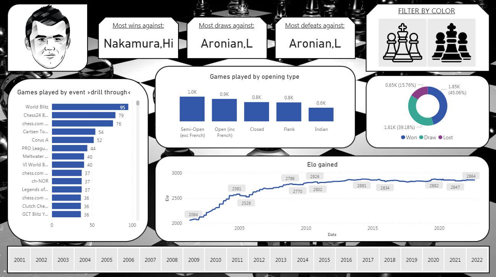
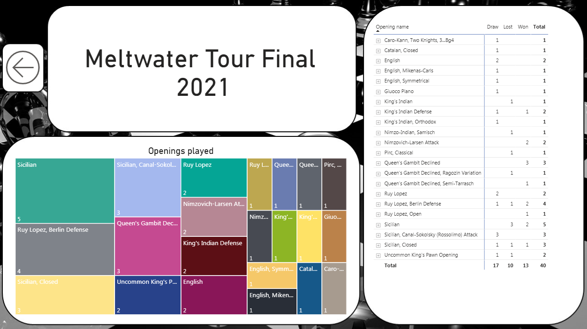

 

 

### Description
This project offers an interactive and insightful dashboard that explores the world of Magnus Carlsen's chess games. From strategic openings to pivotal game events, visualize and analyze his gameplay. Track performance trends across tournaments and unravel the strategies behind his success.

### Features
Utilization of Power BI to create interactive and insightful data visualizations.
Performance tracking and trends over various tournaments.
In-depth analysis of Magnus Carlsen's chess games.

### Requirements
Power BI Desktop  
Microsoft Excel (optional, for data preprocessing)

### Data
The data used for this analysis is available in the data directory. It can also be found on kaggle [[HERE]](https://www.kaggle.com/datasets/zq1200/magnus-carlsen-complete-chess-games-20012022)
